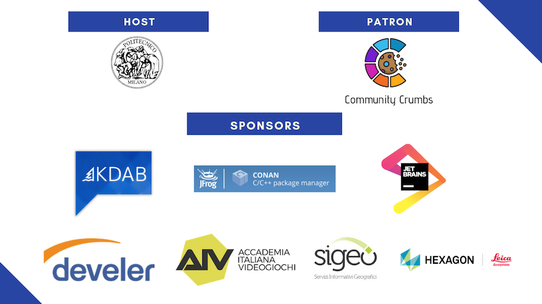

# Modules in C++20

---

 

---

## Modules

- Most anticipated
- Most misunderstood
- Changes the way we write C++
- Doesnt't change language semantics 

---

# Why modules?

---

## C++ compilation model

- Inherited from C
- C preprocessor for code reuse
- Preprocessor doesn't know about rest of the language

---

## Examples
 